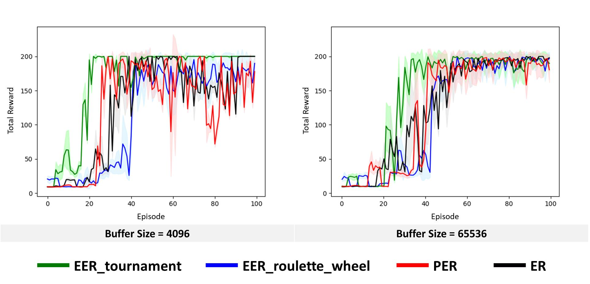

# EER: Deep Reinforcement Learning with Evolutionary Experience Replay

This is the PyTorch implementation for EER: Deep Reinforcement Learning with Evolutionary Experience Replay for CartPole-v0

---

## Results


## Installation

Clone the EER repository:
```bash
git clone https://github.com/weber12599/EER.git
cd EER
```

### Building using Docker
```bash
docker build --rm -t ec/eer:base .
docker run --name eer -it --gpus all \
    --env="DISPLAY" --env="QT_X11_NO_MITSHM=1" \
    -v /tmp/.X11-unix:/tmp/.X11-unix:rw \
    -v `pwd`:/root/mount/EER \
    ec/eer:base bash
```

---

## Training and evaluation
```
cd /root/mount/EER
xvfb-run -a -s "-screen 0 1400x900x24 +extension RANDR" -- python3 Train_CartPole.py
```
